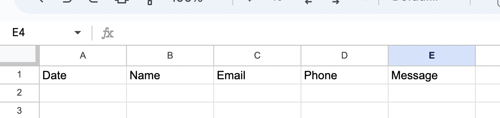
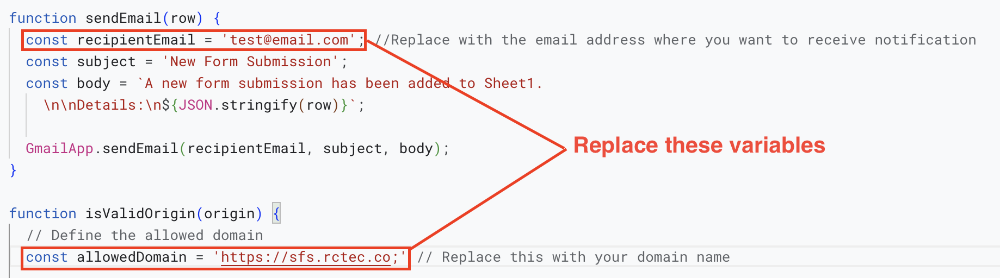
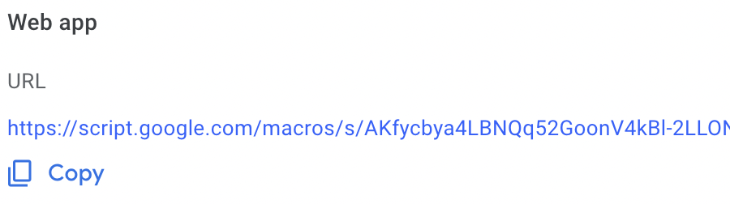
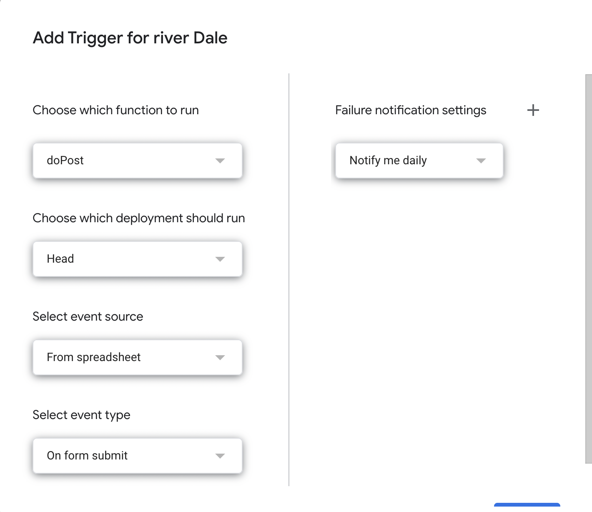

# Google Sheets Form Handler & Email Notifier

The inspiration for this project is [this repo](https://github.com/levinunnink/html-form-to-google-sheet) by levinunnink.

This project provides a Google Apps Script for handling form submissions and sending email notifications when new submissions are received. It is designed to work with Google Sheets as a backend to store form data that only accepts data to be accepted form a specific domain hence cross-origin resource sharing (CORS) configuration is also managed. 


## Getting Started

## 1. Create all the necessary headers in your google sheet
- Create a new Google Sheets spreadsheet or use an existing one to store your form submissions.
- Make sure the name of the first sheet is "Sheet1" or change the name according to the name of the sheet. 
- In your google sheet named sheet 1 create all the headers that you will be submitting in the form. Note that the name attribute in your HTML form Will be same as the header name. 


## 2. Set up the Google Apps Script
- Open Google Sheets and go to Extensions > Apps Script.
```js
const sheetName = 'Sheet1';
const scriptProp = PropertiesService.getScriptProperties();

function initialSetup() {
  const activeSpreadsheet = SpreadsheetApp.getActiveSpreadsheet();
  scriptProp.setProperty('key', activeSpreadsheet.getId());
}


function sendEmail(row) {
  const recipientEmail = 'test@email.com'; //Replace with the email address where you want to receive notification 
  const subject = 'New Form Submission';
  const body = `A new form submission has been added to Sheet1. 
    \n\nDetails:\n${JSON.stringify(row)}`;

  GmailApp.sendEmail(recipientEmail, subject, body);
}

function isValidOrigin(origin) {
  // Define the allowed domain 
  const allowedDomain = 'https://sfs.rctec.co;' // Replace this with your domain name

  // Check if the origin matches the allowed domain 
  return origin.includes(allowedDomain);
}

function doPost(e) {
  const lock = LockService.getScriptLock();
  lock.tryLock(10000);

  try {
    const origin = e && e.parameter && e.parameter.origin ? e.parameter.origin : '';
    const isValid = isValidOrigin(origin);

    if (!isValid) {
      // If the origin is not valid, return an error response
      return ContentService
        .createTextOutput(JSON.stringify({ 'result': 'error', 'message': 'You are not allowed to access this resource.' }))
        .setMimeType(ContentService.MimeType.JSON);
    }

    // Proceed with the rest of your code to handle valid submissions
    const doc = SpreadsheetApp.openById(scriptProp.getProperty('key'));
    const sheet = doc.getSheetByName(sheetName);

    const headers = sheet.getRange(1, 1, 1, sheet.getLastColumn()).getValues()[0];
    const nextRow = sheet.getLastRow() + 1;

    const newRow = headers.map(function (header) {
      return header === 'Date' ? new Date() : e.parameter[header];
    });

    sheet.getRange(nextRow, 1, 1, newRow.length).setValues([newRow]);

    // Send email with the last entered row
    sendEmail({ 'row': nextRow, 'data': newRow });

    return ContentService
      .createTextOutput(JSON.stringify({ 'result': 'success', 'row': nextRow }))
      .setMimeType(ContentService.MimeType.JSON);
  }

  catch (e) {
    // Return error response
    return ContentService
      .createTextOutput(JSON.stringify({ 'result': 'error', 'error': e }))
      .setMimeType(ContentService.MimeType.JSON);
  }

  finally {
    lock.releaseLock();
  }
}
```
- Replace the contents of the script editor with the provided code from the code.gs file in this repository.
- You need to replace 2 important variables in the script.
    - The email that will receive the notification  ```**const recipientEmail = '*test@email.com*'**```
    - The domain name form whis the form will be submitted make sure to enter as in this example   ```**const allowedDomain = '*https://yourdomain.com*';**```
    - You Can also update other subject and body variables which is completely optional.


## 3. Run the Script 
- Once you are done with writing the script click on the Run button that is like play symbol.
- A modal that asks for permission go to **Advanced>Click on the (Unsafe link)**.
- The Execuion should the start and complete.


## 4. Deploy the Script as a Web App
- Once you are done with writing the script go to **Deploy > New Deployment**
- Write a discription for the deployment and on **Who can access > Anyone**
- Once you have done this copy the webapp url and put in in some safe location we will need this while interigating in your form.


## 5. Create A trigger 
- On the left hand side of the  app script windo select the clock icon which is a trigger.
- Click on the Add trigger button.
- **Choose which function to run > doPost()**
- **Select event type > On Form Submit**
- Save the trigger


## 6. Create all the necessary headers in your google sheet
- In your google sheet named sheet 1 create all the headers that you will be submitting in the form. Note that the name attribute in your HTML form Will be same as the header name. 


## 7. Create HTML form
- Create a HTML with the attributes with the name that you set in the header of the google sheet.
- In the actions attribute fo the form replace it with web app you copied in Step 3. If you did not copy the web app link on the app script check **Deploy>Manage Deployment>Select deployment and find the web URL**.

```
 <form method="POST" action="YOUR_APP_SCRIPT_URL">
        <input name="Name" type="text" placeholder="Name" required>
        <input name="Email" type="email" placeholder="Email" required>
        <textarea rows="8" name="Message" id="message" placeholder="If you have any query or messages please enter" class="formbold-form-input"></textarea>
        <button type="submit">Send</button>
 </form>
```
## Optional Step
If you don't want to redirect into webapp you can do that by using JS event listner to prevent the default action using the following js code
```js
window.addEventListener("load", function () {
        const form = document.getElementById('g-form');
        form.addEventListener("submit", function (e) {
            e.preventDefault();
            const data = new FormData(form);
            const action = e.target.action;
            fetch(action, {
                method: 'POST',
                body: data,
            })
                .then(() => {
                    document.getElementById('message').innerHTML = 'Message Sent Successfully';
                })
        });
    });
```


 